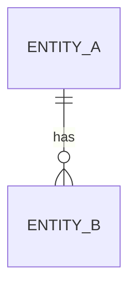
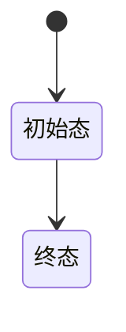

---
title: 业务上下文：[业务模块名]
date: YYYY-MM-DD
status: draft
tags:
  - 实习/飞冰科技
  - BusinessContext
tech_stack:
  - Java
  - SpringBoot
ai_agent_context: "本篇记录XX业务模块的逻辑与系统架构（数据流、实体关系、状态机），可用于回答业务规则与接口行为相关问题"
---

# 业务上下文：[业务模块名]

> 原则：剥离具体代码，只记数据流与实体关系

## 业务模块概述
（该模块解决什么业务问题？核心职责？）

## 核心实体关系

## 数据流
（请求如何流转？关键节点？）

## 状态机
（订单/任务等有状态流转的，用 stateDiagram 表达）

## 与代码的对应关系
（提示：哪些接口/服务对应上述流转？只记对应关系，不贴代码）

## Changelog
- v1.0 (2026-08-22)：初始模板，基于实习知识库方案创建
