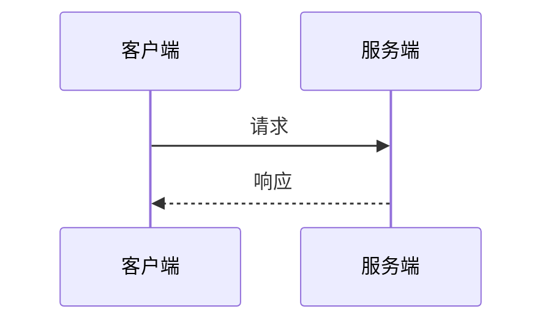

---
title: 技术专题：[专题名]
date: YYYY-MM-DD
status: draft
tags:
  - 实习/飞冰科技
  - TechDeepDive
tech_stack:
  - Java
  - SpringBoot
ai_agent_context: "本篇为技术专题复盘，包含方案图解、最佳实践与避坑指南，可用于回答XX技术方案的实现细节与选型原因"
---

# 技术专题复盘

## 背景与动机
（该技术点是从哪些日日志/踩坑中提炼的？反复出现的频率？）

## 架构/方案图解
（复杂链路用 Mermaid 画时序图或流程图，Agent 偏好结构化 Mermaid）

## 核心代码与规范
- **最佳实践**：(公司是怎么封装的？)
- **避坑指南**：(为什么不直接用常规写法？踩过什么坑？)

## 复盘结论
（一句话结论 + 可复用要点）

## Changelog
- v1.0 (2026-08-22)：初始模板，基于实习知识库方案创建
