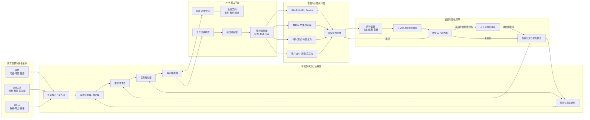

# AI 原生项目：以 Skill 为能力单元的智能体架构

> 从“人编写程序”走向“人借助 AI 组织能力、创造产品”。

## 背景与动机

传统软件项目以代码、接口和人工操作为中心：人理解需求、设计方案、调用工具、编写代码并检查结果。

随着 AI 能够读取完整项目、理解自然语言、调用工具和持续执行任务，一个新的问题出现了：能否把项目转化为 AI 可以理解、选择、组合、执行和验证的能力系统？

如果可以，未来产品开发的核心门槛将逐渐从“会不会亲自编写每一段代码”，转向：

- 能否理解真实业务；
- 能否发现客户真正的问题；
- 能否把模糊想法定义成可执行目标；
- 能否组织 AI、工具与项目能力；
- 能否用证据判断结果是否真正有效。

## 核心命题

### 1. 智能体是大脑，Skill 是手脚

智能体负责理解上下文、澄清需求、制定计划、选择能力、处理异常和组织验收；Skill 负责执行边界清晰的具体能力。

### 2. 现有接口可以逐步转化为 Skill

传统 API 主要描述参数、返回值和错误信息；真正可供智能体使用的 Skill 还要补充业务语义、使用条件、禁止条件、风险、依赖和验收证据。

> Skill = 接口能力 + 业务语义 + 使用规则 + 执行流程 + 验收标准。

### 3. 项目需要从代码结构化走向业务能力结构化

除了控制器、服务、数据库和页面，还要显式表达：用户意图、业务规则、任务流程、权限边界、失败恢复与成功标准。

### 4. 人不必在每项能力上胜过 AI

人的核心作用不是亲自完成所有步骤，而是提供方向、现实信息、价值选择、关键授权和最终责任。

## 总体架构图

## 从自然语言到真实结果的执行链路

1. 客户或业务人员用自然语言提出问题和目标。
2. 系统识别用户身份、项目环境和可用权限。
3. 需求解析器提取意图、对象、约束、风险与缺失信息。
4. 需求澄清器通过追问或读取项目事实消除歧义。
5. 任务规划器把目标拆成步骤、依赖、输入输出和验收条件。
6. Skill 路由器根据能力、权限、成本和成功率选择 Skill。
7. 工作流编排器组织串行、并行、条件、重试和补偿流程。
8. 受控执行器调用已有项目接口、数据、研发工具或外部系统。
9. 系统收集日志、结果、指标和代码差异作为执行证据。
10. 自动测试、规则校验、独立评估器和必要的人工确认共同验收。
11. 未达标结果重新进入澄清与规划；有效经验沉淀回项目记忆与 Skill。

## Skill 的标准结构

每个 Skill 至少应当定义以下内容：

| 维度 | 需要回答的问题 |
|---|---|
| 业务目的 | 它解决什么真实问题？ |
| 触发条件 | 什么情况下应该调用？ |
| 禁止条件 | 什么情况下不能调用？ |
| 输入契约 | 必须提供哪些信息，格式和范围是什么？ |
| 执行能力 | 实际调用哪个 API、工具、脚本或工作流？ |
| 权限风险 | 会影响哪些人、数据、资金或外部系统？ |
| 业务不变量 | 无论如何都不能破坏什么？ |
| 成功证据 | 用什么日志、数据、测试或指标证明完成？ |
| 失败处理 | 如何重试、降级、补偿、回滚或转人工？ |
| 版本维护 | 由谁负责，如何兼容项目变化？ |

## AI 如何真正“懂项目”

只读取代码还不足以理解项目。完整的项目认知应关联：

- 源代码与接口；
- 产品文档与业务规则；
- 历史需求与设计决策；
- 数据模型与运行指标；
- 客户反馈与失败案例；
- 权限体系与合规要求；
- Skill 的使用历史和实际成功率。

当这些信息被持续同步并能互相验证时，AI 才可能成为项目的统一认知层，减少产品、开发、客户和管理者之间的信息断层。

## 人在闭环中的作用

人在 AI 原生系统中的作用可以归纳为五点：

1. **定义方向**：决定服务谁、解决什么问题、创造什么价值。
2. **连接现实**：补充客户情绪、潜台词、组织关系和现实限制。
3. **作出取舍**：决定优先满足谁、接受什么成本、坚持哪些底线。
4. **授予权限**：对资金、生产数据、客户触达和不可逆操作授权。
5. **承担责任**：对系统最终影响和价值选择承担责任。

> 人不必在能力上全面胜过 AI，但需要决定 AI 的力量被用于哪里，以及什么结果值得被创造。

## 可信验收与治理底座

同一个 AI 同时实现和验收，可能形成自证闭环。可靠系统不能只依赖“人盯着”，也不能只依赖“AI 自己判断”，而要组合多类证据：

- 确定性的自动测试；
- 可执行的业务规则；
- 真实运行指标；
- 独立上下文的 AI 评估；
- 高风险节点的人工审批；
- 完整的操作审计；
- 可用的撤销、回滚与止损机制。

贯穿所有模块的治理底座至少应包括：身份认证、最小权限、风险分级、密钥管理、成本限制、人工审批、审计追踪和回滚止损。

## 可落地的演进路径

不需要推翻原有项目，可以渐进式改造：

1. 选择一个真实、频繁、结果明确的业务场景。
2. 盘点该场景涉及的现有接口、脚本、文档和人工操作。
3. 将单个接口包装为最小 Skill，并补齐业务契约。
4. 定义可自动判断的成功证据和失败回滚方式。
5. 先让 AI 生成计划、由人批准后执行。
6. 稳定后逐步降低低风险步骤的人工介入。
7. 持续记录成功率、失败类型和人工接管原因。
8. 将多项稳定 Skill 组合成端到端业务工作流。

## 复盘结论

这套思想最终要实现的不是“AI 帮程序员多写代码”，而是：

> 以真实业务为起点，把项目中的接口、工具、数据和规则封装成可被 AI 理解与调用的 Skill；由智能体作为认知与决策中枢，把自然语言需求解析成结构化目标和执行计划，组合各项能力完成真实交付，并通过证据形成可信闭环。

理解世界，是为了发现真实问题；创造世界，是把理解转化为现实。AI 连接理解与行动，人负责赋予它方向。

## 待继续验证

- [ ] 选择飞冰科技中的一个真实业务场景进行 Skill 化试点。
- [ ] 定义统一的 Skill 描述规范和注册格式。
- [ ] 验证需求解析器在模糊客户表达下的澄清能力。
- [ ] 建立执行证据、自动验收和人工审批的最小闭环。
- [ ] 比较“人工执行”“AI 辅助执行”“AI 自主执行”的成本、正确率和交付速度。

## Changelog

- v1.0（2026-08-29）：基于夜间头脑风暴整理 AI 原生项目、Skill 能力平台、智能体大脑、人机职责与可信验收闭环。

