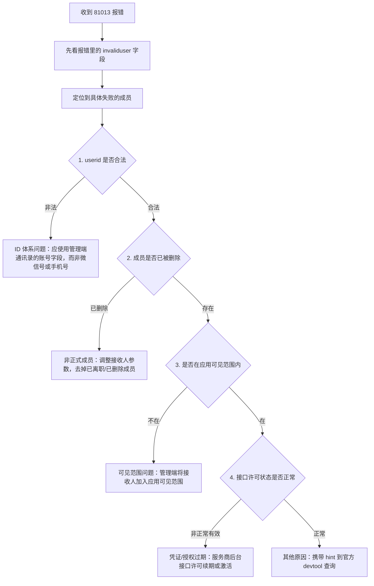

# 企业微信 81013 报错排查

## 背景与动机

从 2026-09-03 的批量推送个别人失败问题提炼。81013 是企业微信消息推送（向成员发消息、群发、批量推送）的高频报错，且「之前能推、突然推不动」的反馈反复出现，值得沉淀一条标准排查链路，避免每次零散定位。

## 错误码说明

- **错误码**：81013
- **报错信息**：`user & party & tag all invalid`
- **官方定义**：UserID、部门ID、标签ID 全部非法或无权限。
- **典型返回**：报错 JSON 中常带 `invaliduser` / `invalidparty` / `invalidtag` 字段，可直接定位到具体出错的接收人，是排查的第一手线索。

## 排查决策树

## 三类根因谱系与处理

### 1. ID 体系问题（userid 非法）

- **现象**：`invaliduser` 里出现的是手机号或微信号格式。
- **根因**：userid 不是手机号、也不是微信号，而是管理端【通讯录 → 成员 → 账号】字段，企业内唯一，由数字/字母/`-_@.` 组成。
- **处理**：改用正确的 userid 作为接收人参数。

### 2. 非正式成员 / 可见范围问题

- **现象**：成员此前能收到消息，之后突然失败，管理端未做过修改。
- **根因**：成员、部门或标签已被删除；或成员被移出应用的可见范围。
- **处理**：已删除的成员从接收人参数中剔除；仍在职的成员在管理端重新加入应用可见范围。

### 3. 凭证 / 授权过期（代开发场景）

- **现象**：正式推送链路正常，但个别账号持续失败，且前两类都排查无果。
- **根因**：代开发场景下，企业员工账号许可状态不是「正常有效」，接口凭证/授权过期。
- **处理**：进入企业微信服务商后台【应用管理 → 企业微信接口许可 → 接口拦截提醒】，查看「激活成员许可状态」，对异常账号做激活/续期。

## 避坑指南

- **先看 `invaliduser` 字段**：报错已经告诉你是哪个成员出问题，不要从代码全局排查。
- **别把 userid 当成手机号/微信号**：这是最常踩的坑，直接导致「看着没错其实非法」。
- **「突然推不动」优先怀疑状态变化**：成员被移出可见范围、许可过期，而非代码改动。
- **代开发场景别漏接口许可**：官方文档未覆盖的第三类根因，最容易在服务商后台的「接口拦截提醒」里找到答案。

## 复盘结论

81013 = 接收人参数在「ID → 存在性 → 可见范围 → 许可状态」四个层面中至少一处失效。按决策树从上到下排查，先看 `invaliduser` 定位成员，再依次核对 userid 合法性、成员存在性、可见范围与接口许可，绝大多数个案能在 5 分钟内定位，不必盲目改代码。

## Changelog

- v1.0 (2026-09-03)：基于 2026-09-03 批量推送 81013 报错排查沉淀，结合官方错误码定义与代开发许可场景补充。
